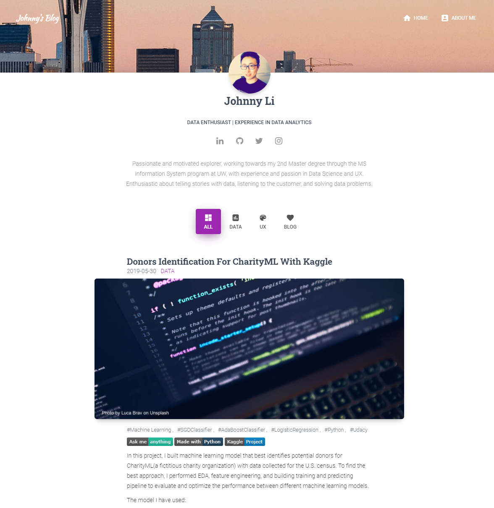

It's been a year since last time I update my blog. Recently, I want to get back to writing blog again. However, I encounter some issues.

1. [Hexo](https://hexo.io/), the static web generator I used, was not compatible with current node.js version in my system.  

1. Somehow node.js was extremely slow in WSL2.  

1. I prefer working with the language that I'm more familiar with.

Therefore, I start looking for other solutions. After comparing and trying several static web generators. I picked Hugo. The reason is sample. Hugo is fast, and I find the theme I like.  

Here is the screenshot for my perverse website. Hexo has tens of theme too. But I didn't find one fit me needs. So, I created my own theme. The design is based on [Material Kit](https://demos.creative-tim.com/material-kit/). 

