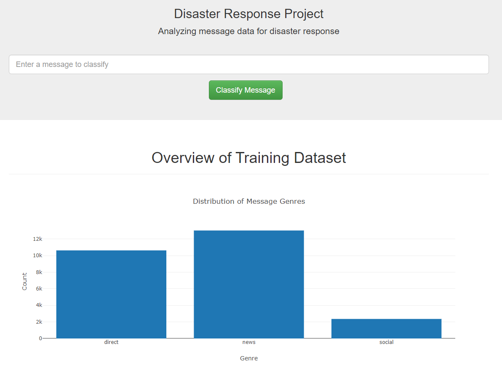

*Disaster Response Web Application* is a Web app that can help emergency organizations analyze incoming messages and classify the messages into specific categories (e.g. Water, Food, Hospitals, Aid-Related) during a disaster event. The app is based on Nature Language Processing and Random Forest Classifier ML model. The data was collected by Figure Eight and provided by Udacity.


The techniques I used in this project include:

- SQLite in Python
- Bag of Words (BOW)
- Multilabel classification
- Build Machine Learning Pipeline
- Grid Search Cross Validation
- Random Forest Classifier
- K nearest neighbors (KNN)
- Build a Flask web app 

> You can find the full analysis in [my GitHub repo](https://github.com/iamjohnnyli/disaster-response-web-app).

## Data
The data files associated with this project are from [Figure Eight](https://www.figure-eight.com/dataset/combined-disaster-response-data/)

- messages.csv: FIgure Eight provide 26,248 messages
- categories.csv: Raw categories data, total 36 categories.

## Project Process

1. ETL Pipeline
    - Loads `messages` and `categories` dataset
    - Clean data
    - Feature Engineering
    - Stores it in a SQLite database

2. ML Pipeline
    - Loads data from the SQLite database
    - text processing and machine learning pipeline
    - Trains and tunes a model using GridSearchCV
    - Exports the model

3. Build web app
    - Create HTML templates
    - Build Flask web application


## Folder Structure

```
├── README.md          
│
├── models                   <- Trained models and ML pipeline
│   ├── classifier.pkl       <- Saved model
│   └── train_classifier.py  <- Scripts to train model sdf
│
├── requirements.txt         <- File for reproducing the environment
│
├── data                     <- Raw and processed Data; data     
│   │                           cleaning script
│   ├── messages.csv         <- Raw messages data
│   ├── categories.csv       <- Raw categories data
│   ├── DisasterResponse.db  <- Saved processed data
│   └── process_data.py      <- Scripts to process data
│
├── notebooks                <- Jupyter notebooks
│
└── App                      <- Source code for use in this project.
    ├── templates            <- Flask html templates 
    └── run.py               <- Scripts to create start Flask server. 
```

## Full Instructions

- Installation
    Install Python 3.5+
    Run ```pip install -r requirements.txt```
- Prepare data
    1. Clone or download the repo
    2. Open terminal and navigate to the project folder
    3. Run ```python data/process_data.py data/disaster_messages.csv data/disaster_categories.csv data/DisasterResponse.db```
- Train model
    5. Run ```python models/train_classifier.py data/DisasterResponse.db models/classifier.pkl```

- Start Web app
    6. Run ```cd app```
    7. Run ```python run.py```
    8. Open web browser and go to http://loclhost:3001 or http://0.0.0.0:3001

## Screen Shot


<!--  -->


------------------------


------------------------
