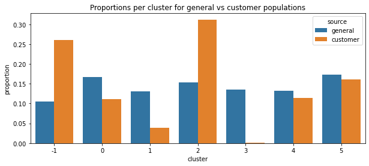
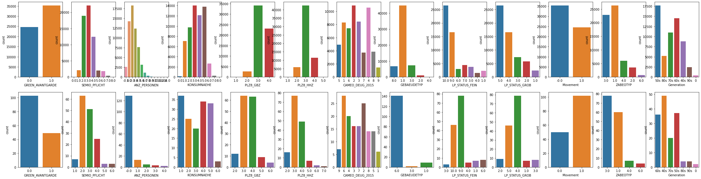

This is one of the Udacity Data Scientist Nanodegree Project. This project aims to identify segments of the population from the core customer base for a mail-order sales company in Germany. Therefore, these segments can then be used to direct marketing campaigns towards audiences with the highest expected rate of returns.

The techniques I used in this project include:  

1. Data cleaning  
1. Encoding and processing mixed-type feature  
1. Feature Scaling and Dimensionality Reduction
1. Clustering
1. Performance improvement with OpenBLAS

> You can find the full analysis in [my GitHub repo](https://github.com/iamjohnnyli/identify-customer-segments/blob/main/Identify_Customer_Segments.ipynb).

## Data

The data files associated with this project (not included in this repository):

- `Udacity_AZDIAS_Subset.csv`: Demographics data for the general population of Germany; 891,211 persons (rows) x 85 features (columns).
- `Udacity_CUSTOMERS_Subset.csv`: Demographics data for customers of a mail-order company; 191,652 persons (rows) x 85 features (columns).
- `Data_Dictionary.md`: Detailed information file about the features in the provided datasets.
- `AZDIAS_Feature_Summary.csv`: Summary of feature attributes for demographics data; 85 features (rows) x 4 columns

## Analysis Structure

1. Data exploration and data cleaning (85% of the analysis)
2. Feature Engineering (One Hot, Scaling, and PCA)
3. Clustering with k-means

## Conclusion

I use the elbow method to find that 6 is the optimal number for clustering, which means the model segments customers and the general population into 6[^**] groups. We can find the proportion of customers in cluster 2 is higher than the general population, which suggests people in cluster 2 are the target audience. We also find that, in cluster 3, the customer is underrepresented, which means people in that group are outside of the target demographics.  

Comparing 2 segments, we can find there are some key differences. For example:

- Distance from building to point of sale: People in cluster 3 are closer to Pos then people in cluster 2.
- Wealth / Life Stage Typology: More people in cluster 2 are upper class
- Type of Building: Most builds in cluster 2 are residential build.
- Social status: Most people in cluster 2 are top earners and most people in cluster 3 are house owners.

## Licensing and Acknowledgements

Udacity Data Scientist provided the starting code for this project.
Udacity partners at Bertelsmann Arvato Analytics provided the data.

[^**]: Cluster -1 is the group I add for checking the proportion of data that miss more than 30% information.