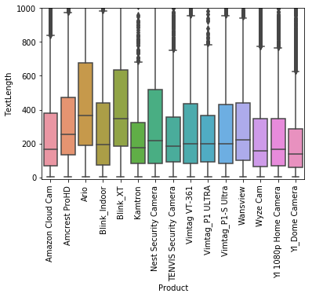
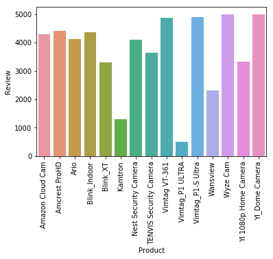
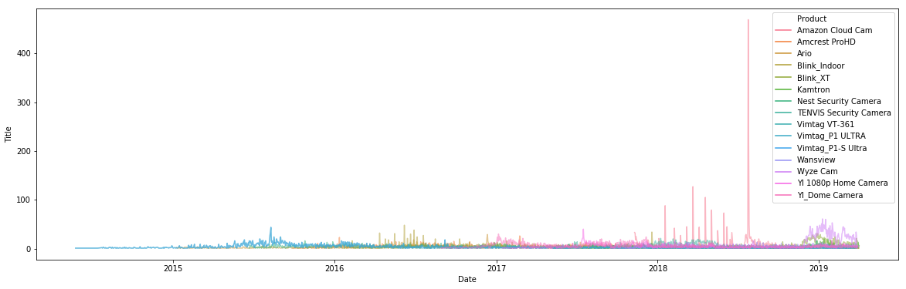
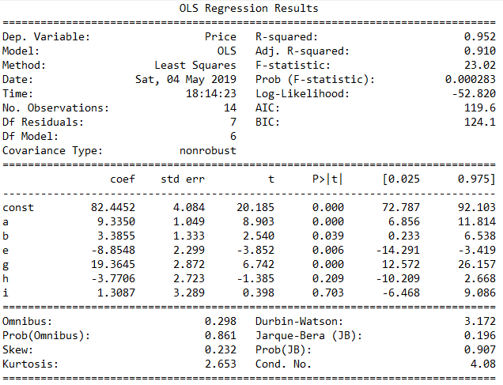

[](https://github.com/iamjohnnyli/ama)     [](https://www.python.org/) [](https://www.mathjax.org/)

Customer reviews contain a large amount of information. One of the recurring subjects of NLP is to understand customer opinion through statement analysis of customer reviews. However, Basic Sentimental Classification can only tell customers' overall impression about the product. It can't tell customers' opinions of specific features of the product. But, if we dive deeper into the customer reviews, we can get more information.
My goal is to extract features from reviews, identify each feature's opinion, quantify the sentiment using econometrics, and then generate a price strategy based on it.


The main techniques I used are:

1. Web Clawing: Get customer reviews from Amazon.
1. Nature Language Processing: Identify product features.
1. Sentiment Analysis: Identify polarity of opinions regarding product features.
1. Linear Regression: Regression analysis for opinions of the features and the price.


>The ```Jupyter Notebook``` goes along with this post **will** be available in my Repo on [my Github]() soon.


## Data Overview

The product category I was working on is the home security camera. I scraped reviews of targe product and its competitors from Amazon.com. The dataset contains 53,657 reviews of 15 different home security cameras from Amazon.com with the following information for each one:

|**Name**|**Description**|
|----|----|
|**Product**|Name of the Product|
|**Username**|User's ID|
|**Stars**|1-5 rating for the product|
|**Title**|The subject of the review|
|**Date**|The review date|
|**Review**|Review text|
|**Helpfulcount**|How many people click "Helpful" button|
|**ReviewTotal**|How many comments under this review|

The average length of reviews of the product is around 200 words, and most of the product has 2000 reviews.



Most of reviews are in the range of 4 years.



## Methodology
My approach includes 9 steps.


graph TD
A( Amazon Review Raw Data ) --> B( Data Cleaning  )
B --> C( Sentences Separation )
C --> D( Subject/Object Separation )
D --> E( Sentiment Scoring )
D --> F( Feature Extraction )
E --> G( Feature Reputation )
F --> G( Feature Reputation )
G --> H( Sentiment Quantifying  )
H --> I( Price Premiums Prediction )



## Conclusion



To Be Continued.