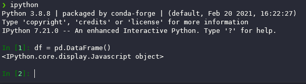
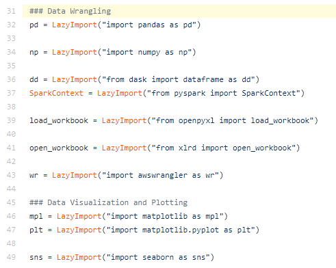
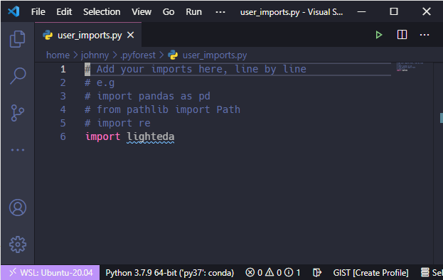

Usually, the first step we all do for any Python project is importing required packages. So, the beginning of the file usually looks like this: 

```python
import xxxx as xxx
from xxxx import xxxx
```

Importing packages is one of my least favorite parts when I'm working on a Data Scientist project. Packages like *pandas*, *numpy*, *lighteda*,  *matplotlib.pyplot*, and *seaborn* are commonly used for my projects. I need to repeat this step in every single Jupyter Notebook. Moreover, when the analysis/research dives deeper, and I need to import new packages in the middle, I have to go back to the beginning and import new packages (If you are using Jupyter Notebook, don't forget to press `Ctrl` + `Enter`).





I can reduce some repetitive works by using template tools like cookiecutter.  




But, is there a way to automatically import related packages and add import statements for me, like this?



But how? **Pyforest** - a package can automatically import packages for you.


Pyforest can "lazy" import the packages and add the import statement to your Jupyter Notebook. It will not import packages you are not using. 

You can install it using pip:
```shell
pip install --upgrade pyforest
python -m pyforest install_extensions
```

The installation will add pyforest_autoimport.py to your Jupyter and IPython default startup settings. Therefore, you can start coding in Jupyter or Ipython and don't need to import pyforest.



Also, you can notice that I didn't type the full name of pandas library. Pyforest has already included all the common abbreviations.


You can also edit  ~/.pyforest/user_imports.py to add your customized import statements.



Pyforest works better on Jupyter Notebook or IPython. If you want this feature to work in other editors, you can import Pyforest first. e.g.
```python
import pyforest
pyforest.active_imports()
```

This is my daily dose of Python tricks. I hope this post can help you. I strongly recommend you try [cookiecutter](https://github.com/iamjohnnyli/cookiecutter_data_analysis) and [Pyforest](https://github.com/8080labs/pyforest) to automate your Data Science/Analysis workflow.

------------------------


------------------------